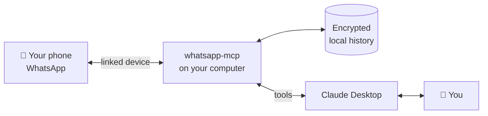
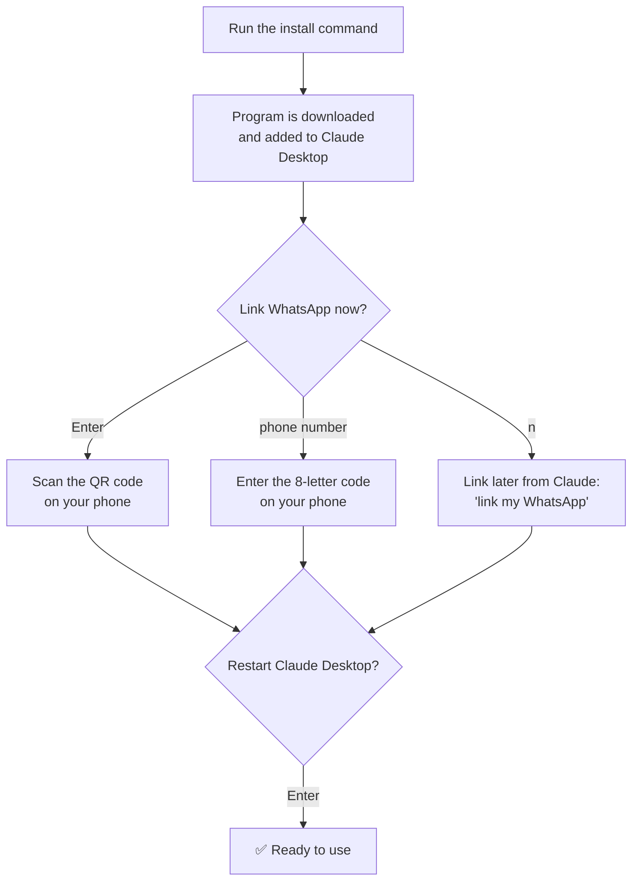
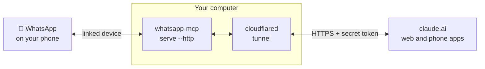
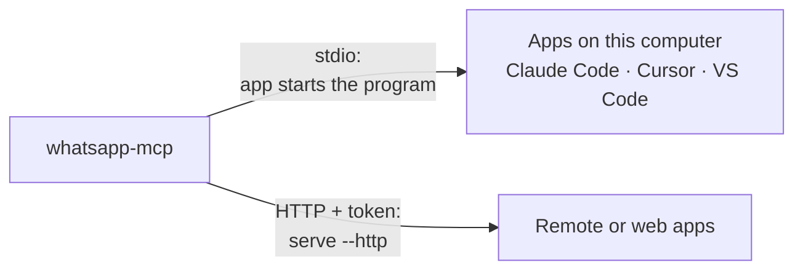
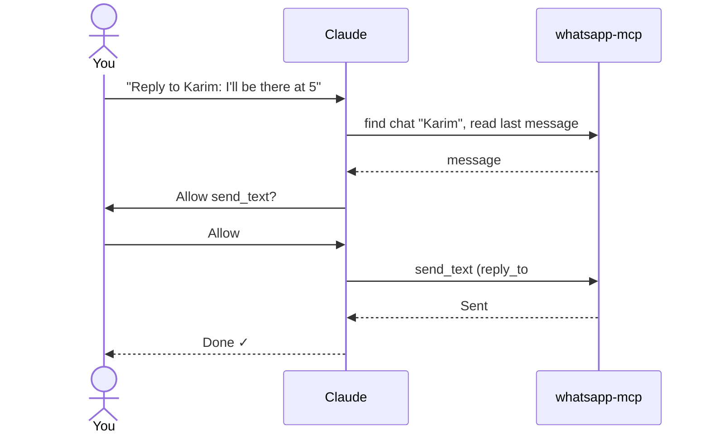
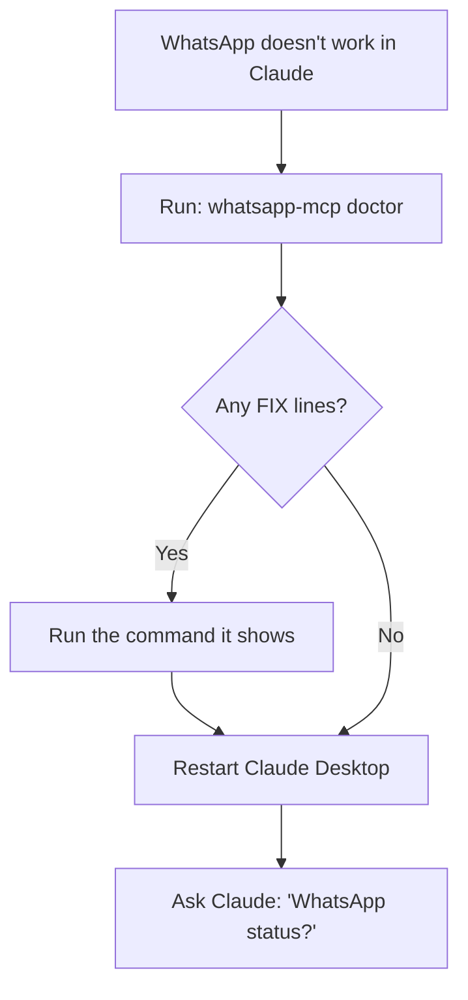

# Use your WhatsApp from Claude

whatsapp-mcp links your WhatsApp to Claude as a linked device, like WhatsApp Web. Use it in Claude Desktop, on claude.ai and the Claude phone apps through a secure link to your computer, or in any other MCP app. Claude can read, search and summarise your chats, and send messages when you approve.

- Windows, macOS and Linux
- One program, no accounts
- Messages stay on your computer, encrypted

**Contents:** [How it works](#how-it-works) · [Setup](#setup) · [claude.ai and phone](#use-it-from-claudeai-and-your-phone) · [Other MCP apps](#use-it-with-other-mcp-apps) · [What to ask](#what-to-ask) · [Permissions](#permissions) · [Update and fix](#update-and-fix) · [Safety](#safety)

## How it works

Claude Desktop starts whatsapp-mcp in the background. It connects to WhatsApp from your computer and keeps a local, encrypted copy of your chats. Claude only sees a message when it calls a tool to read it.



Your phone stays the main device. whatsapp-mcp appears under **Linked devices** on the phone.

## Setup

About 3 minutes. You need:

| What | Why |
|---|---|
| Claude Desktop | Installed and signed in |
| WhatsApp on your phone | To scan the QR code once |
| A terminal | PowerShell on Windows, Terminal on Mac |



### 1. Run the install command

Open a terminal and paste the command for your system.

**Windows (PowerShell)**

```powershell
irm https://raw.githubusercontent.com/nchdatta/whatsapp-mcp/main/scripts/install.ps1 | iex
```

**macOS / Linux**

```sh
curl -fsSL https://raw.githubusercontent.com/nchdatta/whatsapp-mcp/main/scripts/install.sh | sh
```

It downloads the latest release, checks its checksum and adds it to Claude Desktop. Your other Claude Desktop settings are kept.

### 2. Link your WhatsApp

The installer asks to link right away:

```
Link your WhatsApp now?
  Press Enter to show a QR code, type your phone number
  (with country code) for a pairing code, or type n to skip:
```

Press **Enter** to show a QR code, then on your phone open **WhatsApp › Settings › Linked devices › Link a device** and scan it.

Prefer no QR code? Type your number with country code, like `8801712345678`, and enter the code under **Link with phone number instead**. Keep the window open until it says it's done, so recent chats can sync.

### 3. Restart Claude Desktop

Press **Enter** when asked *"Restart Claude Desktop now?"*. Doing it by hand? Quit Claude Desktop completely, including from the system tray or menu bar, then open it again. **whatsapp** then shows under **Settings › Developer**.

### 4. Try it

Ask Claude: `What did the family group talk about today?`

## Use it from claude.ai and your phone

*Optional.* claude.ai and the Claude phone apps can't start programs on your computer. Instead, your computer runs whatsapp-mcp as a small web server, and a tunnel gives it a private HTTPS address that claude.ai connects to.

| | Claude Desktop | claude.ai and phone apps |
|---|---|---|
| Setup | Install command only | Install, then start a server and a tunnel |
| Works when | Claude Desktop is open | Your computer and both commands are running |
| Access | Only on this computer | Anywhere, through a secret link |
| Use both at once? | No. Both use the same WhatsApp session, so quit Claude Desktop while serving remotely. | |



1. **Install and link first.** Follow the [setup](#setup) above so WhatsApp is linked. Then quit Claude Desktop.
2. **Start the server.**
   ```sh
   whatsapp-mcp serve --http
   ```
   It prints a local address like `http://127.0.0.1:8080/mcp/<token>`. Keep this window open.
3. **Open a tunnel.** Install [Cloudflare Tunnel (cloudflared)](https://developers.cloudflare.com/cloudflare-one/connections/connect-networks/downloads/), then in a second terminal run:
   ```sh
   cloudflared tunnel --url http://127.0.0.1:8080
   ```
   It prints an address like `https://<random>.trycloudflare.com`. This quick address changes every run; a named Cloudflare tunnel keeps it fixed.
4. **Add the connector in claude.ai.** Open **Settings › Connectors › Add custom connector** and enter the tunnel address followed by `/mcp/` and your token:
   ```
   https://<random>.trycloudflare.com/mcp/<token>
   ```
   The connector then works on claude.ai and in the Claude phone apps. Run `whatsapp-mcp token` to see the token again.

> **The connector link is a password.** Anyone with the link can read all your chats and send messages as you. Don't share it or show it in screenshots. If it leaks, run `whatsapp-mcp token --rotate` and restart `serve --http`; the old link stops working.

## Use it with other MCP apps

*Optional.* whatsapp-mcp is a standard MCP server, so any app that supports MCP can use it: Claude Code, Cursor, VS Code, Windsurf, and others. Run the install command once to get the program and link WhatsApp, then point your app at it.



### Apps on the same computer

Most apps take an `mcpServers` entry like this. Use the program's full path:

```json
{
  "mcpServers": {
    "whatsapp": {
      "command": "C:\\Users\\YOU\\AppData\\Local\\Programs\\whatsapp-mcp\\whatsapp-mcp.exe",
      "args": ["serve"]
    }
  }
}
```

On macOS and Linux the path is `~/.local/bin/whatsapp-mcp` (write it out in full, e.g. `/Users/you/.local/bin/whatsapp-mcp`).

For Claude Code, one command does it:

```sh
claude mcp add --scope user whatsapp -- whatsapp-mcp serve
```

### Remote or web apps

Run `whatsapp-mcp serve --http` with a tunnel, as in the [claude.ai steps](#use-it-from-claudeai-and-your-phone). Apps that can send headers can use `https://<address>/mcp` with `Authorization: Bearer <token>` instead of putting the token in the address.

> **One app at a time.** All apps share one WhatsApp session. If two run whatsapp-mcp at once, one goes offline. Close the other app first.

## What to ask

Talk to Claude normally. You can name people and groups the way they appear in your phone; Claude finds the right chat.

| To | Ask | What happens |
|---|---|---|
| Catch up | "Anything new on WhatsApp?" | Lists chats with unread messages and summarises them |
| Summarise a chat | "Summarise the office group from yesterday" | Reads the chat and gives you the main points and decisions |
| Find something | "When did Rahim send the invoice?" | Searches all chats by words, person, date or attachments |
| Reply | "Reply to Karim's last message: I'll be there at 5" | Sends as a quoted reply after you approve it |
| Look at photos and files | "What's in the picture Mom sent?" | Opens the attachment; Claude can see images directly |
| Send a file or voice note | "Send report.pdf to Rahim" | Sends images, documents, audio and voice notes |



Reading happens freely. Sending always waits for your approval unless you change it.

**Watch for new messages.** In Claude Desktop, click **+** and choose the **watch** prompt. Claude keeps watching for new messages and tells you when one needs attention.

**Away message.** To auto-reply when you don't answer within a minute, run `whatsapp-mcp away on "I'm away, will reply soon"`. Turn it off with `whatsapp-mcp away off`.

## Permissions

Claude Desktop asks before each tool runs. Set this once in **Settings › Connectors › whatsapp**: let the reading tools run freely and keep asking for anything that sends or changes something.

| Tool | What it does | Setting |
|---|---|---|
| `list_chats` | Chats with unread counts | ✅ Always allow |
| `read_chat` | Reads a chat's messages | ✅ Always allow |
| `search_messages` | Searches all chats | ✅ Always allow |
| `message_context` | Messages around one message | ✅ Always allow |
| `find_contacts` | Finds people by name or number | ✅ Always allow |
| `get_attachment` | Opens photos and files | ✅ Always allow |
| `wait_for_messages` | Waits for new messages | ✅ Always allow |
| `whatsapp_status` | Linked and connected? | ✅ Always allow |
| `link_whatsapp` | Shows a QR code to link | ✅ Always allow |
| `send_text` | Sends a message as you | ⚠️ Ask |
| `send_file` | Sends a file or voice note | ⚠️ Ask |
| `mark_read` | Sends blue ticks | ⚠️ Ask |
| `unlink_whatsapp` | Removes this computer from WhatsApp | ⚠️ Ask |

## Update and fix

| Command | When to use it |
|---|---|
| `whatsapp-mcp update` | Install the latest version. Claude mentions when one is out. Claude Desktop can stay open. |
| `whatsapp-mcp doctor` | Something isn't working. It checks everything and says how to fix each problem. |
| `whatsapp-mcp login` | Link WhatsApp again, for example after unlinking on the phone. |
| `whatsapp-mcp uninstall` | Remove it from Claude Desktop and from your computer. |



## Safety

> **Keep approval on for sending.** Your chats contain text other people wrote. A crafted message could try to get Claude to forward private chats or message someone. The approval prompt is what stops that.

> **Unofficial connection.** whatsapp-mcp links as a WhatsApp Web device through an unofficial library. Use it for your own chats; bulk or automated messaging can get an account banned.

**Your data stays local.** History and attachments are stored encrypted on your computer. Nothing goes to a server except what Claude reads to answer you.
